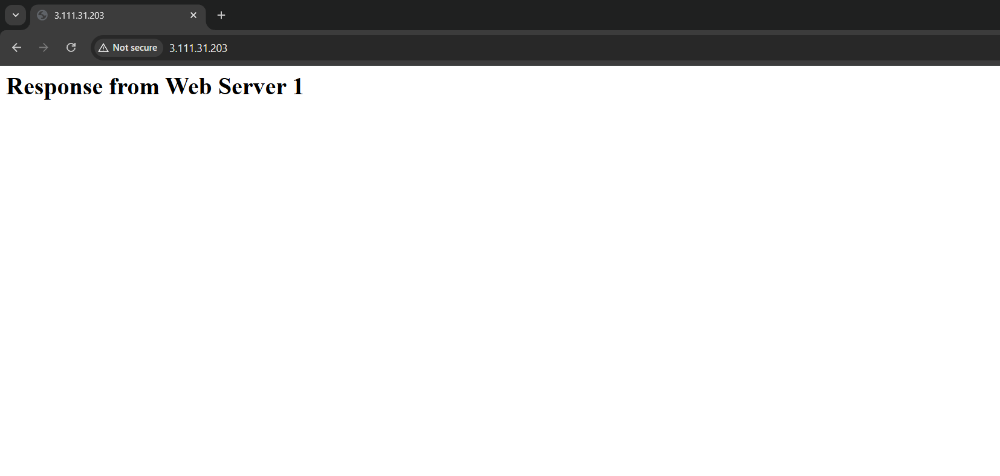

# AWS EC2 + ALB + Nginx Mini Project

## 📌 Project Overview
This project demonstrates how to deploy a highly available static website on AWS using EC2 instances, Nginx web server, and an Application Load Balancer (ALB).

## 🛠️ Services Used
- Amazon EC2 (Amazon Linux)
- Application Load Balancer (ALB)
- Target Groups
- Security Groups
- Nginx Web Server
- SSH (Remote Access)

## 🏗️ Architecture

## 🔄 Workflow
1. User accesses the website via browser.
2. Request is routed through the Application Load Balancer.
3. ALB forwards traffic to healthy EC2 instances.
4. Nginx serves the static HTML content.

## 🌐 Website Output

## ❤️ Target Group Health Check

## 🌐 Project Links
🔗 Live URL (ALB DNS / Public Access):
Web server1 - http://3.111.31.203/
Web server2 - http://13.233.34.173/

## ⚠️ Note on Free Tier
Since this project was implemented using AWS Free Tier, the EC2 instances were stopped after successful testing to avoid unnecessary costs.  
Screenshots are shared for verification purposes.

## 📂 Repository Contents
- `architecture/` – Architecture diagrams
- `screenshots/` – AWS console and output screenshots
- `html/` – Website source code

## 👤 Author
**Nithya Bharathi**

